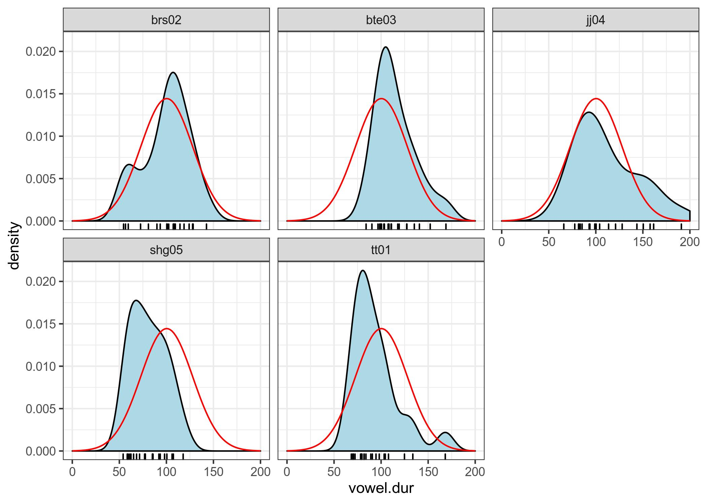
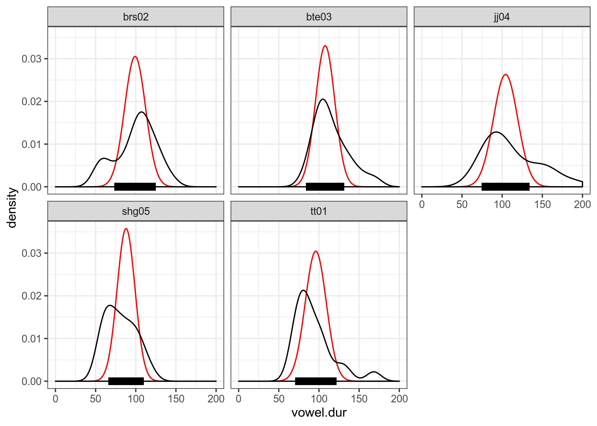

```{r, message=FALSE}
knitr::opts_chunk$set(eval = FALSE)
library(tidyverse)
```

## task 3.1

В вашей папке лежат данные исследования исландских данных [Coretta 2017]. В ваших данных наблюдения по длительности гласного [o] в разных контекстах для 5 спикеров.

* `speaker` --- ID спикера
* `vowel.dur` --- длительность гласного (в разных словах, в разных контекстах, но мы для простоты будем это игнорировать и считать все наблюдения независимыми).



Используя среднее с 10% усечением (аргумент `trim` функции `mean`) и стандартное отклонение от всех наблюдений в качестве параметров априорного нормального распределения (на верхнем графике красным), произведите байесовский апдейт данных каждого спикера (красным на графике внизу) и посчитайте для получившихся апосториорных распределений байесовский 95% интервал (толстая черная линия на графике внизу).



Все подсчеты в этом домашнем задании следует производить с точностью до последнего знака после запятой.

### 3.1.1

```{r}
coretta <- read_csv("hw3_caretta.csv")
```

Выведите в консоль датафрейм со средним и стандартным отклонением апостериорного распределения спикера `brs02`.

### 3.1.2

```{r}

```

Выведите в консоль датафрейм с границами байесовского 95% интервала для спикера `tt01`.

### 3.2

В датасет `chekhov_letters.csv` записаны частоты встречаемости букв в разных расказах А. П. Чехова. Выберите букву "а" и проведите байесовскую эмпирическую оценку. Полученное распределение используйте в качестве априорного и проведите байесовский апдейт каждого рассказа. 

### 3.2.1

Выведите в консоль название рассказа с максимальным апостериороным средним?

```{r}
chekhov <- read_csv("hw3-chekhov_letters.csv")
```

### 3.2.2

Выведите в консоль название рассказа с минимальным апостериороным средним?

```{r}

```

